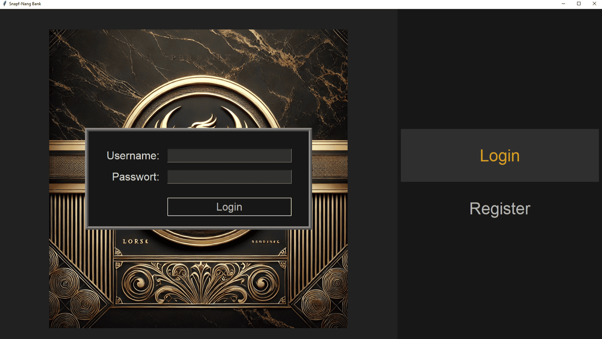
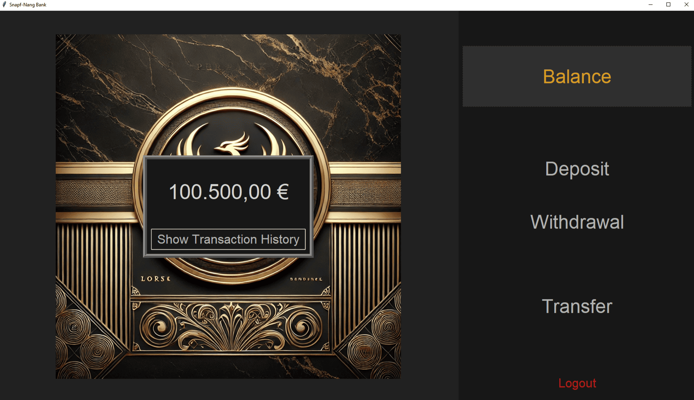
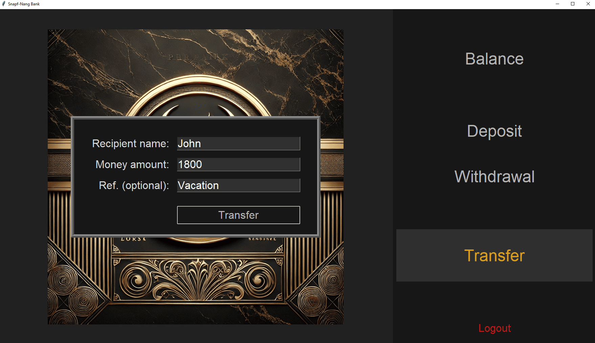
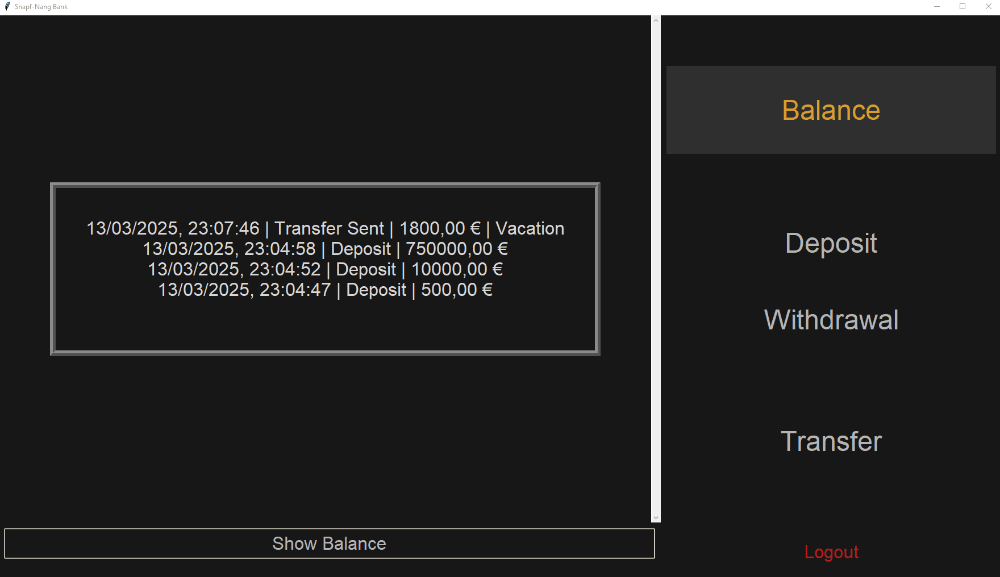

# 💸 Snapf-Nang Bank

# Clingonia by MadMotion



## 🌹 Introduction
Our first small python project: the Snapf-Nang Bank. 

<br>

## 🏡 Repository structure

- 📁 `code` contains Python source codes.
- 📁 `data` contains images and databases.
- 📝 `main.py` is the primary file for launching the program.
- 📝 `README.md` is what you are reading right now.

<br>

## ⚙️ Please note:

⚠️ This software is optimized for Windows.

<br>

## 🌱 Getting started

<br>

### 📜 Prerequisites

📦 Install the pillow module:
```
pip install pillow
```

<br>

### 🖥️ Installation

To use this repository locally, clone it:
```
git clone https://github.com/AdrianHenze/Snapf-Nang.git
```

<br>

# 🏛️ Using the Snapf-Nang Bank

## 🚀 Program initialization

Ensure that you are in the directory of your cloned repository with 📝 `main.py` and type the following:
```
python main.py
```
This will launch the program.

<br>

### 🛠️ Troubleshooting

If you encounter unexpected issues, please report them right away. Your input is extremely helpful to us.

<br>

# 👁️ Insights

### Balance


### Transfer


### Transactions History

